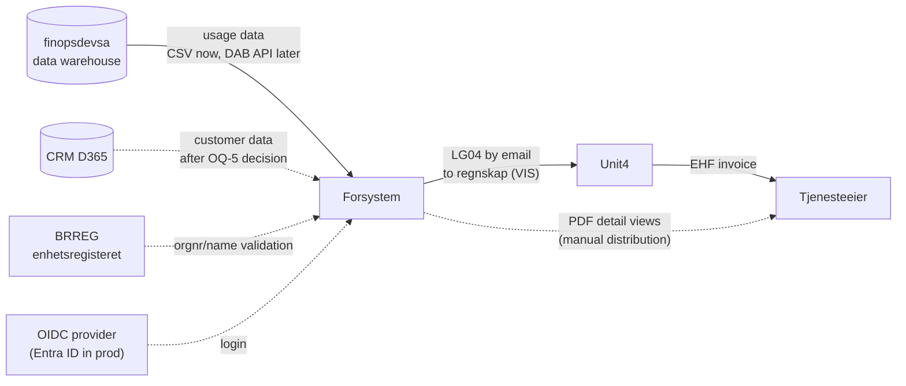
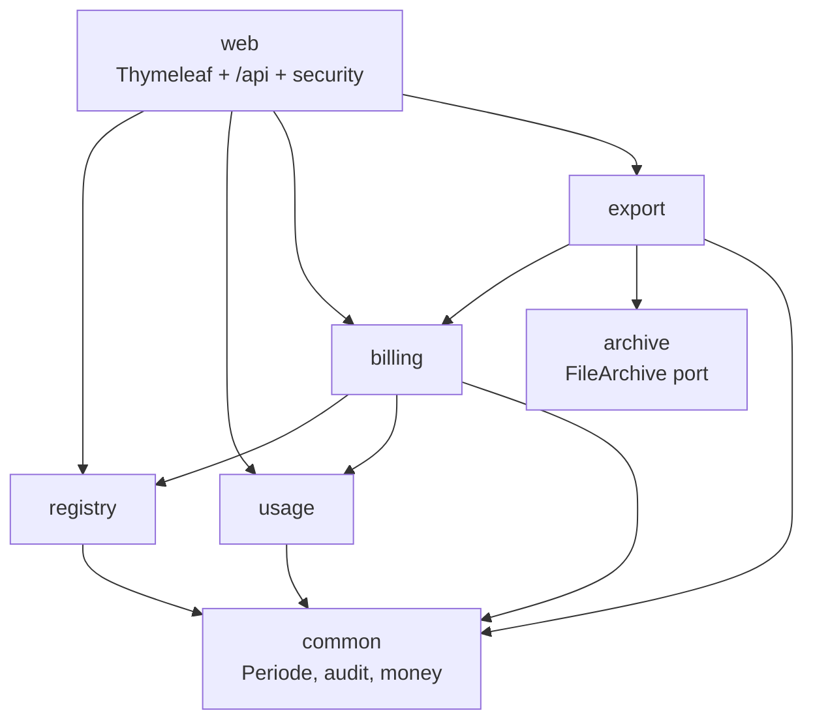

# 02 — Architecture

## System context



Solid arrows are MVP reality; dashed arrows are integrations behind ports (BRREG is live
in prod, CRM/DWH pending) or manual steps.

## Module dependencies



## Stack (decided, with rationale)

| Layer | Choice | Why |
|---|---|---|
| Language/runtime | Java 21 (LTS) | Direct reuse of the LG04 writer + golden tests from `../agresso`; org competence; boring and stable |
| Framework | Spring Boot 3.5.x, Maven | Same as the old repo — zero translation cost for the ported code |
| Persistence | PostgreSQL 16+, Flyway, Spring Data JDBC | Schema versioned in git from day one (the old system's biggest gap); simple aggregates, no JPA magic |
| Web UI | Thymeleaf + htmx, Digdir **Designsystemet** CSS | Server-rendered CRUD + tables + buttons is the whole UI; one deployable, no frontend build pipeline; REST under `/api` keeps a future SPA possible |
| Auth | OIDC via Spring Security (Entra ID in prod) | Standard protocol — any OIDC provider works locally (e.g. Keycloak in compose, or a dev stub profile) |
| Files | Blob storage behind a `FileArchive` port | Local filesystem in dev/test, Azure Blob in prod |
| Packaging | Docker (temurin JRE slim, multi-stage build) | Runs on Container Apps, AKS, or any container host |
| CI | GitHub Actions: build, test, image → registry | Registry configurable (ACR/GHCR) — not hardcoded |

Considered and rejected: Kotlin/.NET/Node rewrite (loses the LG04 reuse and org familiarity
for no functional gain); JPA/Hibernate (overkill for this aggregate shape); separate React
SPA now (doubles the moving parts for a CRUD UI; revisit post-MVP if the UI grows).

## Module layout (single deployable, modulith)

```
no.digdir.forsystem
├── registry/        products, price versions/prices, customers, references, kundenummer rules
├── usage/           bruksdata import: CSV parsing, validation, storage
├── billing/         fakturakjøring: generation engine, controls, statuses, approval
├── export/          LG04 writer (ported), PDF renderer, CSV/XLSX; writes via FileArchive
├── archive/         FileArchive port + adapters (local, azure-blob)
├── web/             Thymeleaf controllers + /api REST + security config
└── common/          period type, money, audit logging, error handling
```

Dependency direction: `web → billing/registry/usage/export → common`. `archive` is invoked
by `export` through its port. No module reaches into another's internals — package-private
by default, explicit public API per module.

## Ports and adapters (the portability core)

| Port (interface, in core) | MVP adapter | Future adapter |
|---|---|---|
| `UsageDataSource` | `CsvUploadUsageSource` | `DwhUsageSource` (when contract exists, OQ-4) |
| `CustomerSource` | local registry tables | `Dynamics365CustomerSource` (after 2026-08-10, OQ-5) |
| `FileArchive` | `LocalFileArchive` | `AzureBlobArchive` (prod), S3 possible |
| `Notifier` | no-op | email/Teams on run events |

**Rule: no Azure SDK import outside adapter classes.** The core never knows where files
land or where identities come from.

## Azure-ready, not Azure-locked

- 12-factor config: everything via environment variables / Spring profiles (`local`,
  `test`, `prod`). No config value requires Azure to exist.
- Secrets are plain env vars. In Azure they are *supplied* by Key Vault references /
  managed identity at the platform level — the application code never talks to Key Vault.
- Auth is OIDC; Entra ID is one issuer URL among any.
- DB is vanilla PostgreSQL — no Azure-specific extensions.
- `docker compose up` must always produce a fully working system (app + PostgreSQL +
  local file archive + dev auth), offline.

## Cross-cutting decisions

- **Billing period** is a value type (`Periode`, first day of month), always an explicit
  parameter through every layer. Deriving it from the clock is allowed only in the UI as a
  *default suggestion*.
- **Money**: `numeric(12,2)` in DB, `BigDecimal` in code; LG04 øre conversion
  (`×100`) happens only in the export module, with rounding half-up, never truncation.
- **Encoding**: LG04 files are written as Windows-1252 directly
  (`Charset.forName("windows-1252")`), covered by an encoding test with æ/ø/å. No iconv.
- **Idempotency**: re-generating a period requires discarding (FORKASTET) the previous run;
  enforced by a partial unique index (see docs/03).
- **Audit**: every state change (approve, price change, import, export) writes
  `hendelseslogg`.
- **Observability**: JSON structured logs, Spring Actuator health/readiness; run outcomes
  are data (status on `fakturakjoring`), not just log lines.
- **Roles**: `LESER` (read), `FORVALTER` (maintain registries, import, generate),
  `GODKJENNER` (approve/export). Mapped from OIDC claims/groups.
