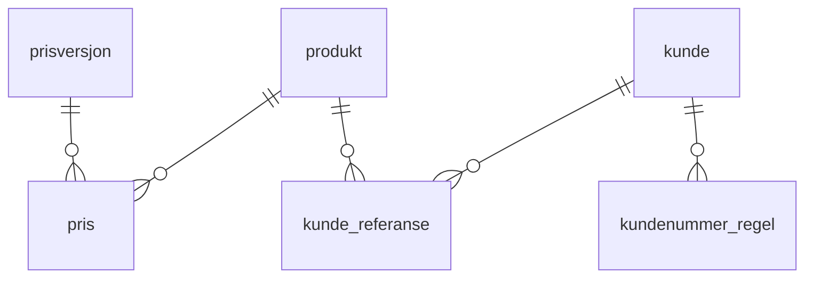
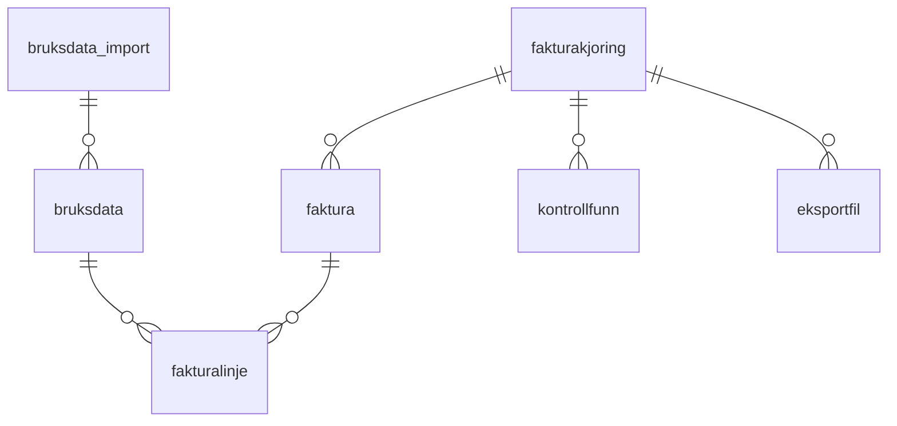

# 03 — Data model (Flyway sketch)

Authoritative starting point for the schema. The implementing agent turns these into real
Flyway migrations (`src/main/resources/db/migration/`), may refine types/indexes, but must
preserve the design decisions at the bottom of this document. Naming follows the FinMod
data-element sheet (Norwegian). Requires PostgreSQL 15+ (`unique nulls not distinct`).

## ER overview





Cross-links not drawn: `faktura → kunde`, `fakturalinje → produkt/pris`,
`fakturakjoring → prisversjon`, `bruksdata → produkt`.

## V1__grunnregistre.sql — products and prices

```sql
create table produkt (
    id          bigint generated always as identity primary key,
    kode        text not null unique,        -- 'melding','formidling','varsling','autorisasjon','studio','appinfra'
    navn        text not null,
    artikkel_id integer,                     -- Unit4 article; TODO(OQ-2)
    konto       text,                        -- kontering per product, not constants; TODO(OQ-2)
    dim_1       text,
    dim_2       text,
    dim_4       text,
    enhet       text not null default 'transaksjon',
    aktiv       boolean not null default true
);

create table prisversjon (
    id         bigint generated always as identity primary key,
    navn       text not null unique,         -- 'Prisliste 2027'
    gyldig_fra date not null,
    gyldig_til date,
    status     text not null default 'UTKAST'
        check (status in ('UTKAST', 'AKTIV', 'ARKIVERT'))
);

create table pris (
    id             bigint generated always as identity primary key,
    prisversjon_id bigint not null references prisversjon,
    produkt_id     bigint not null references produkt,
    enhetspris     numeric(12,4) not null,
    unique (prisversjon_id, produkt_id)
);
```

## V2__kunderegister.sql — temporary customer registry (until CRM)

```sql
create table kunde (
    id                    bigint generated always as identity primary key,
    organisasjonsnummer   text not null unique check (organisasjonsnummer ~ '^[0-9]{9}$'),
    virksomhetsnavn       text not null,
    fakturamottaker_orgnr text,              -- deviating recipient: another legal entity
    avtalestatus          text not null default 'AKTIV'
        check (avtalestatus in ('AKTIV', 'INAKTIV', 'UNDER_AVKLARING')),
    kilde                 text not null default 'MANUELL',   -- becomes 'CRM' when D365 takes over
    oppdatert_av          text not null,
    oppdatert_at          timestamptz not null default now()
);

create table kunde_referanse (
    id                bigint generated always as identity primary key,
    kunde_id          bigint not null references kunde,
    produkt_id        bigint references produkt,   -- null = customer default; product row overrides
    fakturareferanse  text,
    bestillingsnummer text,
    unique nulls not distinct (kunde_id, produkt_id)
);

create table kundenummer_regel (
    id            bigint generated always as identity primary key,
    kunde_id      bigint not null references kunde,
    kundenummer   text not null,               -- master: Unit4
    produkt_id    bigint references produkt,
    servicekode   text,                        -- e.g. Utdanningsdirektoratet: two servicekoder
    tilleggstekst text,                        -- e.g. Politiet: shared kundenummer, distinct text
    unique nulls not distinct (kunde_id, produkt_id, servicekode)
);
```

## V3__bruksdata.sql — usage input (CSV now, DWH later, same tables)

```sql
create table bruksdata_import (
    id           bigint generated always as identity primary key,
    filnavn      text not null,
    periode      date not null check (extract(day from periode) = 1),
    kilde        text not null default 'CSV' check (kilde in ('CSV', 'DWH')),
    status       text not null default 'MOTTATT'
        check (status in ('MOTTATT', 'VALIDERT', 'AVVIST')),
    antall_rader integer,
    lastet_av    text not null,
    lastet_at    timestamptz not null default now()
);

create table bruksdata (
    id                  bigint generated always as identity primary key,
    import_id           bigint not null references bruksdata_import,
    periode             date not null check (extract(day from periode) = 1),
    organisasjonsnummer text not null,         -- the usage-generating entity
    produkt_id          bigint not null references produkt,
    type                text not null
        check (type in ('BRUKSVOLUM', 'AZURE_KOSTNAD', 'SMS_KOSTNAD')),
    antall              numeric(14,2),         -- for BRUKSVOLUM
    belop               numeric(12,2),         -- for pass-through costs
    unique (periode, organisasjonsnummer, produkt_id, type)
);
```

## V4__fakturering.sql — runs, invoices, lines, controls, exports

```sql
create table fakturakjoring (
    id             bigint generated always as identity primary key,
    periode        date not null check (extract(day from periode) = 1),
    status         text not null default 'GENERERT'
        check (status in ('GENERERT', 'GODKJENT', 'EKSPORTERT', 'FORKASTET')),
    prisversjon_id bigint not null references prisversjon,
    generert_av    text not null,
    generert_at    timestamptz not null default now(),
    godkjent_av    text,
    godkjent_at    timestamptz,
    kommentar      text
);
create unique index en_aktiv_kjoring_per_periode
    on fakturakjoring (periode) where status <> 'FORKASTET';

create table faktura (
    id                    bigint generated always as identity primary key,
    kjoring_id            bigint not null references fakturakjoring,
    kunde_id              bigint not null references kunde,
    faktura_uuid          uuid not null unique,   -- UUIDv7; used in PDF filenames
    ordre_nr              integer not null,       -- order_id within the LG04 file
    kundenummer           text not null,          -- snapshot at generation
    tilleggstekst         text,
    fakturamottaker_orgnr text not null,          -- snapshot at generation
    sum_belop             numeric(12,2) not null,
    unique (kjoring_id, kunde_id, kundenummer),
    unique (kjoring_id, ordre_nr)
);

create table fakturalinje (
    id                bigint generated always as identity primary key,
    faktura_id        bigint not null references faktura,
    produkt_id        bigint not null references produkt,
    beskrivelse       text not null,              -- art_desc: 'Bruk av melding januar 2027'
    antall            numeric(14,2),
    enhetspris        numeric(12,4),
    belop             numeric(12,2) not null,
    pris_id           bigint references pris,       -- traceability to the price used
    bruksdata_id      bigint references bruksdata,  -- traceability to the usage basis
    servicekode       text,
    fakturareferanse  text,                         -- snapshot at generation
    bestillingsnummer text                          -- snapshot at generation
);

create table kontrollfunn (
    id          bigint generated always as identity primary key,
    kjoring_id  bigint not null references fakturakjoring,
    faktura_id  bigint references faktura,
    alvorlighet text not null check (alvorlighet in ('BLOKKERENDE', 'ADVARSEL')),
    kode        text not null,      -- 'MANGLER_KUNDENUMMER','INAKTIV_AVTALE','STORT_AVVIK',...
    melding     text not null
);

create table eksportfil (
    id           bigint generated always as identity primary key,
    kjoring_id   bigint not null references fakturakjoring,
    type         text not null check (type in ('LG04', 'PDF', 'CSV', 'XLSX')),
    filnavn      text not null,
    blob_url     text not null,               -- local path in dev, blob URL in prod
    sha256       text,
    opprettet_av text not null,
    opprettet_at timestamptz not null default now()
);
```

## V5__hendelseslogg.sql — audit trail

```sql
create table hendelseslogg (
    id         bigint generated always as identity primary key,
    tidspunkt  timestamptz not null default now(),
    bruker     text not null,
    handling   text not null,       -- 'GODKJENTE_KJORING','ENDRET_PRIS','IMPORTERTE_BRUKSDATA',...
    entitet    text,
    entitet_id bigint,
    detaljer   jsonb
);
```

## V6__seed_produkter.sql

Seed the six product codes (melding, formidling, varsling, autorisasjon, studio, appinfra)
with names. `artikkel_id`, `konto`, `dim_*` stay NULL until Økonomi answers (OQ-2) — the
generation controls must treat NULL kontering as a BLOKKERENDE finding.

## Design decisions (preserve these)

1. **Traceability is structural**: `fakturalinje → bruksdata` (which usage),
   `fakturalinje → pris` + `fakturakjoring → prisversjon` (which price), snapshot columns
   on `faktura`/`fakturalinje` (which reference/recipient *at generation time* — later
   registry edits must not rewrite history).
2. **Invoices group by kundenummer, not by customer**: `unique (kjoring_id, kunde_id,
   kundenummer)`. A customer with two servicekoder naturally yields two invoices; the LG04
   header (one apar_id per invoice) stays consistent.
3. **Run idempotency**: several runs per period allowed only if older ones are FORKASTET
   (partial unique index) — the clean version of the old system's delete-and-rerun.
4. **Usage re-import**: new import for a period deletes the previous import's rows for that
   period and marks it AVVIST (application logic), keeping the natural-key unique constraint
   satisfied.
5. **`ordre_nr` lives on `faktura`, not on lines**: if it turns out LG04 cannot carry
   multiple amount lines per invoice (OQ-1), one faktura is split into several LG04 orders
   at export time — the domain model does not change.
