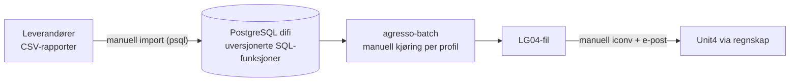
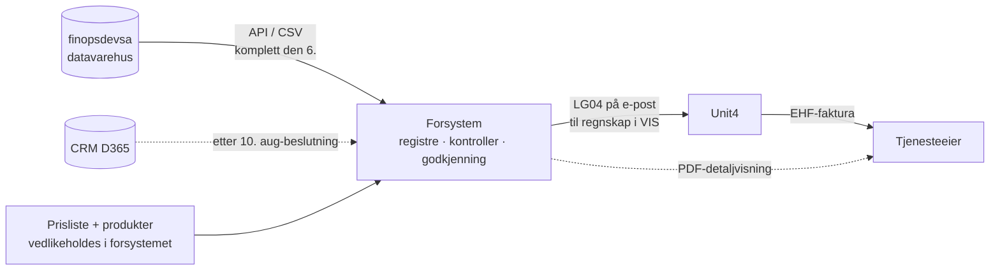
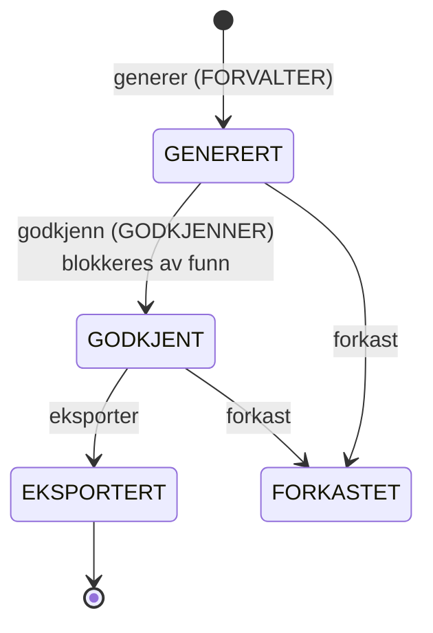
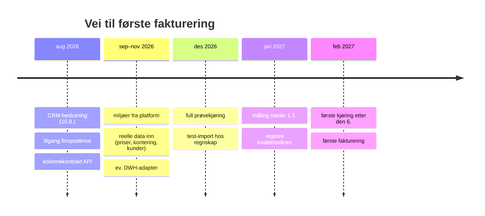

# 10 — Presentasjon: forsystem for fakturering (juli 2026)

Manus/underlag for statuspresentasjonen: hva vi fant, hva som er besluttet, hva MVP-en
gjør, og hva som gjenstår. Diagrammene er mermaid og rendres direkte på GitHub.

## 1. Utgangspunktet: dagens løsning

Dagens fakturering (FEL) fungerer og har vært i drift siden 2019, men prosessen er manuell
i alle ledd, og forretningslogikken ligger i SQL-funksjoner som ikke er versjonert noe sted.

Det mest verdifulle i dagens løsning er LG04-skriveren med tester som låser filformatet
tegn for tegn — den er gjenbrukt i det nye systemet. Dagens løsning røres ikke og
fortsetter for de gamle tjenestene (B-01, B-02).

## 2. Målbildet og avklaringene

Løsningsbeskrivelsen definerer rollene: datavarehuset avgjør *hva* som er fakturerbart,
forsystemet avgjør *hvordan* det faktureres. Alle spørsmålene våre er besvart av prosjektlederen
(omfang, priser, tidslinje), DVH-kontakten (datavarehus, tilgang, datakvalitet) og FEL-kontakten
(leveranserutine) — se [beslutningsloggen](09-beslutningslogg.md).

Nøkkelavklaringer: ny prismodell fra **1.1.2027**; månedlig fakturering av faktisk bruk;
grunnlaget er komplett **den 6. i hver måned**; fila sendes på e-post til regnskap i VIS
som importerer i Unit4 og sender EHF.

## 3. MVP-en: hva den gjør

Én webapplikasjon som erstatter Excel + psql + manuell beregning. Hele månedssyklusen
kjører ende til ende, offline, med `docker compose up` (demo-datasett følger med).

- **Registre**: kunder (med alle Ivars spesialtilfeller: avvikende fakturamottaker,
  produktspesifikke referanser, flere/delte kundenumre), produkter med kontering,
  versjonert prisliste. BRREG-oppslag ved registrering.
- **Bruksdata**: CSV-opplasting med validering og forhåndsvisning før lagring;
  alt-eller-ingenting-import; re-import erstatter.
- **Generering**: fakturagrunnlag per periode — linjer per produkt, fakturaer per
  kundenummer, full sporbarhet (linje → bruksdata + pris), snapshots ved generering.
- **Kontroller**: fem blokkerende (manglende kunde/kundenummer/pris/kontering, inaktiv
  avtale) og tre varsler (stort avvik, nullbeløp, ny kunde). Blokkerende funn hindrer
  godkjenning — feilen som i dag oppdages i Unit4-importen, slipper ikke ut herfra.
- **Godkjenning**: eksplisitt manuelt steg, egen rolle, alt auditlogget.

- **Eksport**: LG04 (byte-identisk med dagens format, Windows-1252 direkte, uten iconv),
  PDF-detaljvisning per faktura, CSV/XLSX. Alt arkiveres med sjekksum.
- **Kvalitet**: 60+ automatiske tester på ekte PostgreSQL, golden-file-tester for LG04,
  ende-til-ende-scenariotest, lasttest (5 000 kunder × 6 produkter < 1 min).

Kravsporingen ([docs/08](08-traceability.md)) viser **10 krav dekket, 4 på avtalt
midlertidig løsning, 7 som venter på data/bekreftelse fra eier, 0 gap**.

## 4. Arkitektur i ett avsnitt

Java 21 / Spring Boot, PostgreSQL med Flyway-versjonert skjema, server-rendret UI med
Designsystemet. Alle eksterne avhengigheter ligger bak porter: bruksdata
(CSV nå / datavarehus-API senere), kundekilde (lokalt register nå / D365 senere),
filarkiv (disk nå / Blob i prod), BRREG. **Azure-klar, ikke Azure-låst**: ingen
Azure-SDK i kjernen, OIDC mot hvilken som helst identitetsleverandør, alt kjører
offline lokalt. Detaljer i [docs/02](02-architecture.md).

## 5. Tidslinje

## 6. Det som gjenstår (kritisk sti — data og prosess, ikke kode)

1. **Kontering per produkt** (konto, dimensjoner, artikkel) fra Økonomi — til da har hver
   kjøring blokkerende funn, med vilje (OQ-2).
2. **Kolonnekontrakt** for `mv_altinn_usage_monthly` fra plattformteamet — avgjør
   produktkode-mapping (OQ-4).
3. **Prisliste 2027** legges inn og aktiveres i UI-et (ingen kode).
4. **CRM-beslutning 10. august** — og hvem som eier kundedata i mellomfasen (OQ-5).
5. **FEL-kontakten/regnskap**: flere beløpslinjer per LG04-ordre (OQ-1), mva-behandling i
   e-postsammendraget (OQ-11), avtale test-import i desember.
6. **Miljøer** fra platform ([#3809](https://github.com/Altinn/altinn-platform/issues/3809))
   — prøvekjøringen bør gå i testmiljø, ikke på en laptop.

## 7. Det som hadde vært fint (etter MVP)

Fra [docs/06](06-future.md), i prioritert rekkefølge slik vi ser det:

1. **Datavarehus-adapter** — API-et finnes allerede; realistisk før desember om
   sikkerhetslaget lander. Da forsvinner det manuelle CSV-uttrekket.
2. **CRM-integrasjon (D365)** — kundedata leses derfra; registeret blir lesekopi.
3. **Automatisk leveranse + kvittering** — e-posten til regnskap erstattes av
   maskinell overføring med statussporing.
4. **Planlagt kjøring** (cron etter den 6.) med varsling til godkjenner.
5. **Avregning** — venter på definisjon fra Økonomi og VIS; sporbarhetskjeden er
   forberedt for rekalkulering og kreditering.
6. På sikt: de gamle tjenestene inn i samme løsning, autoritativ produktkatalog, hostet
   detaljvisning for tjenesteeiere.
