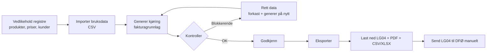
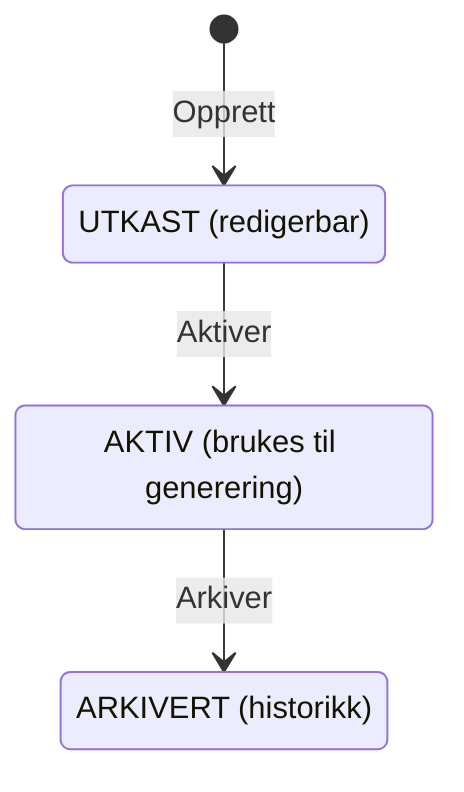
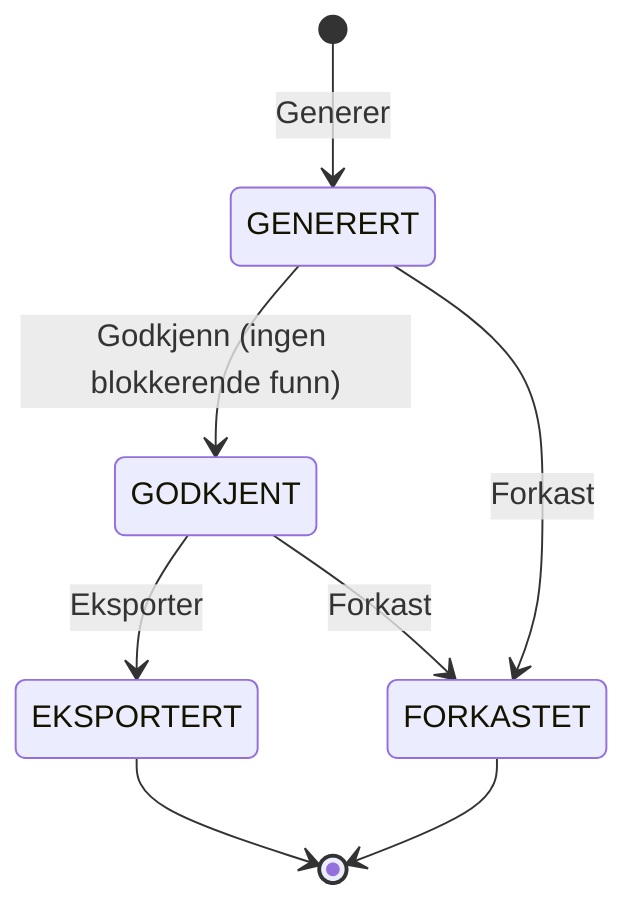
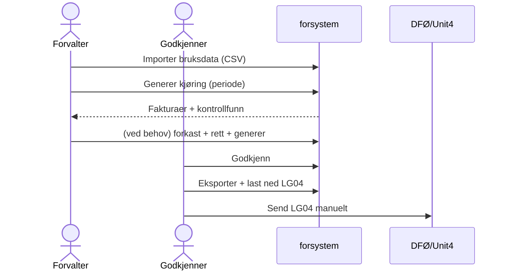

# Brukerveiledning — forsystem

Steg-for-steg innføring i forsystem: hva hver side betyr, hva hver knapp gjør, hvordan alt henger
sammen, og hvordan du kjører en faktureringsrunde fra start til slutt. Skrevet for deg som skal
bruke systemet — ingen forkunnskap om koden nødvendig.

> **Kort fortalt:** forsystem er «forsystemet» som bygger *fakturagrunnlaget* for Altinn-produktene
> under FinMod-prismodellen. Du vedlikeholder registre, importerer bruk, genererer grunnlaget, kjører
> kontroller, godkjenner, og eksporterer filene som sendes videre til Unit4 (via DFØ). Systemet lager
> ikke selve fakturaen — det lager grunnlaget.

---

## Innhold

1. [Det store bildet](#1-det-store-bildet)
2. [Roller — hvem får gjøre hva](#2-roller)
3. [Navigasjon — menyen](#3-navigasjon)
4. [Produkter](#4-produkter)
5. [Prisversjoner](#5-prisversjoner)
6. [Kunder](#6-kunder)
7. [Bruksdata (import)](#7-bruksdata)
8. [Kjøringer (generering, kontroll, godkjenning, eksport)](#8-kjøringer)
9. [Hendelseslogg](#9-hendelseslogg)
10. [Hele månedsrutinen — steg for steg](#10-månedsrutinen)
11. [Kontrollfunn — hva de betyr og hvordan du løser dem](#11-kontrollfunn)
12. [Statusflyt (diagrammer)](#12-statusflyt)
13. [Feilsøking / FAQ](#13-feilsøking)
14. [Ordliste](#14-ordliste)

---

## 1. Det store bildet

Fakturering skjer én gang i måneden, basert på faktisk bruk i **forrige** måned. Flyten gjennom
forsystem er alltid den samme:



Alt skjer **for én valgt periode** (alltid den første dagen i en måned, f.eks. `2027-01`). Perioden
velger du eksplisitt hver gang — systemet gjetter den aldri ut fra dagens dato.

---

## 2. Roller

Hva du kan gjøre avhenger av rollen din (styres av innlogging). I den lokale demoen er du logget inn
som brukeren **dev** med alle roller.

| Rolle | Kan |
|---|---|
| **LESER** | Se alt (registre, kjøringer, logg). Kan ikke endre noe. |
| **FORVALTER** | Alt LESER kan, pluss: vedlikeholde registre, importere bruksdata, generere kjøringer. |
| **GODKJENNER** | Godkjenne og eksportere kjøringer. |

> Prøver du en handling du ikke har rolle for, får du «tilgang nektet» (403). I demoen har du alt.

---

## 3. Navigasjon

Toppmenyen er lik på alle sider:

| Menyvalg | Hva det er |
|---|---|
| **forsystem** | Forsiden (dashbord med snarveier). |
| **Produkter** | De seks Altinn-produktene og kontering. |
| **Prisversjoner** | Årlige prislister, med livssyklus utkast → aktiv → arkivert. |
| **Kunder** | Tjenesteeiere, fakturareferanser og kundenummerregler. |
| **Bruksdata** | Import av bruk (CSV) per periode. |
| **Kjøringer** | Generering, kontroll, godkjenning og eksport av fakturagrunnlag. |
| **Hendelseslogg** | Sporbar logg over alle endringer. |

Rekkefølgen i menyen følger arbeidsflyten: du fyller registre (Produkter → Prisversjoner → Kunder),
importerer Bruksdata, og kjører alt under Kjøringer.

---

## 4. Produkter

**Hva:** de seks produktene som faktureres (`melding`, `formidling`, `varsling`, `autorisasjon`,
`studio`, `appinfra`). Disse er ferdig opprettet i systemet. Det viktigste her er **kontering** —
regnskapskodene som må stå på hvert produkt før grunnlaget kan eksporteres.

**Liste-siden (Produkter):**

| Kolonne | Betydning |
|---|---|
| Kode / Navn | Produktets id og visningsnavn. |
| Enhet | Måleenhet (standard «transaksjon»). |
| Konto / Artikkel-id | Kontering (regnskap). **Er tom («—») til Økonomi leverer verdiene.** |
| Aktiv | Om produktet er i bruk. |

- **Rediger** (per rad) → åpner redigeringssiden.
- **Legg til** (skjema nederst): opprett et nytt produkt med kode, navn og enhet. (Normalt ikke
  nødvendig — de seks finnes fra før.)

**Rediger-siden:**

- **Navn**, **Enhet** — kan endres.
- **Kontering** (feltgruppe): Artikkel-id, Konto, Dim 1, Dim 2, Dim 4. Dette er regnskapskodene som
  havner i LG04-fila. **La stå tomt til Økonomi bekrefter** — tomme verdier gir et blokkerende
  kontrollfunn ved generering, så du kan ikke ved et uhell fakturere med feil koder.
- **Aktiv** — avhukning.
- **Lagre** / **Avbryt**.

> **Sammenheng:** Konto/dimensjoner/artikkel-id herfra skrives inn i LG04-fila ved eksport. Uten dem
> stopper kontrollen deg (kode `MANGLER_KONTERING`).

---

## 5. Prisversjoner

**Hva:** en prisversjon er en prisliste med gyldighetsperiode (typisk ett år). Den har en livssyklus:



**Liste-siden (Prisversjoner):** viser alle versjoner med navn, gyldig fra/til og status (fargelagt
merke). **Åpne** en versjon, eller lag en ny med **Opprett** (skjemaet «Ny prisversjon (utkast)»:
navn, gyldig fra, evt. gyldig til).

**Detalj-siden:**

- Øverst: navn, gyldighet og status.
- **Pristabell** — én rad per produkt:
  - Når versjonen er **UTKAST**: skriv inn **Enhetspris** per produkt og trykk **Lagre** på raden.
  - Når versjonen er **AKTIV/ARKIVERT**: prisene vises, men kan ikke endres (låst).
- **Aktiver** (kun i utkast): setter versjonen aktiv. Systemet sjekker først at
  - **alle aktive produkter har en pris**, og
  - **ingen annen aktiv versjon overlapper** samme datointervall.
  Er noe galt, får du en tydelig melding og aktivering stoppes.
- **Arkiver** (kun når aktiv): pensjonerer versjonen.

> **Sammenheng:** generering bruker den **aktive** prisversjonen som dekker den valgte perioden.
> Bruksvolum × enhetspris = beløp på fakturalinjen.

---

## 6. Kunder

**Hva:** tjenesteeierne som faktureres, med all avtaleinfo. Dette registeret er midlertidig til CRM
(Dynamics 365) eventuelt overtar. Her modellerer vi alle FinMod-spesialtilfellene.

**Liste-siden (Kunder):** virksomhet, orgnr, evt. avvikende fakturamottaker og avtalestatus.
**Ny kunde** åpner opprettingsskjemaet; **Åpne** går til detaljsiden.

**Ny kunde / Grunndata:**

| Felt | Betydning |
|---|---|
| **Organisasjonsnummer** | 9 siffer. Kundens juridiske enhet (den som genererer bruk). |
| **Virksomhetsnavn** | Navnet. |
| **Fakturamottaker orgnr** | *Valgfritt.* Fyll ut hvis en **annen** juridisk enhet skal motta fakturaen (avvikende mottaker — f.eks. Digitale Helgeland fakturert til Brønnøy kommune). |
| **Avtalestatus** | `AKTIV`, `INAKTIV` eller `UNDER_AVKLARING`. Må være AKTIV for å fakturere. |

**Detalj-siden** har tre deler:

1. **Grunndata** — rediger navn, fakturamottaker og avtalestatus. **Lagre**.
2. **Fakturareferanser** — referanser som havner på fakturalinjene.
   - Uten produkt = **standard** for kunden. En rad med produkt **overstyrer** standarden for det
     produktet (fakturareferanse kan være ulik per produkt).
   - Legg til med produkt (valgfritt), fakturareferanse og bestillingsnummer → **Legg til**. Fjern
     med **Slett**.
3. **Kundenummerregler** — kobler kunden til Unit4-kundenummer.
   - **Én faktura per kundenummer.** Har en kunde to kundenummer (f.eks. ulik **servicekode** per
     produkt, som Utdanningsdirektoratet), blir det to fakturaer.
   - Flere kunder kan **dele** ett kundenummer, skilt med **tilleggstekst** (f.eks.
     Politidirektoratet vs. Politi- og lensmannsetaten).
   - Legg til med kundenummer, evt. produkt, servicekode og tilleggstekst → **Legg til**. Fjern med
     **Slett**.

> **Sammenheng — dette avgjør hvordan fakturaene grupperes:** ved generering slås bruk sammen per
> (kunde, kundenummer). Regelen som passer produktet (produkt-spesifikk regel, ellers standarden)
> bestemmer hvilket kundenummer linjen havner på. Mangler en kunde med bruk en passende regel, får du
> et blokkerende funn (`MANGLER_KUNDENUMMER`).

---

## 7. Bruksdata

**Hva:** her laster du opp bruken (volum og pass-gjennom-kostnader) for en periode, som CSV. På sikt
kan et datavarehus mate de samme dataene automatisk — CSV-opplasting forblir en reserveløsning.

**Liste-siden (Bruksdata):**

- **Last opp**-skjema: velg **Periode** (måned) og **CSV-fil**, trykk **Forhåndsvis**.
- Tabell over tidligere importer med status.

**CSV-formatet** (detaljer i [csv-format.md](csv-format.md)): kolonner `periode, organisasjonsnummer,
produktkode, type, antall, belop`. `type` er `BRUKSVOLUM` (bruk `antall`), `AZURE_KOSTNAD` eller
`SMS_KOSTNAD` (bruk `belop`). Eksempel:

```csv
periode,organisasjonsnummer,produktkode,type,antall,belop
2027-01-01,958935420,melding,BRUKSVOLUM,15000,
2027-01-01,958935420,varsling,SMS_KOSTNAD,,1250.50
```

**Forhåndsvisning (før noe lagres):**

- **Summer per produkt** — antall rader og summer, så du kan sammenligne med fila.
- **Avviste rader** — hver feil med linjenummer og årsak (ukjent produkt, feil orgnr, feil periode,
  duplikat, negativ verdi …).
- **Alt-eller-ingenting:** har fila **én** avvist rad, kan den ikke importeres — rett fila og last opp
  på nytt. Ingenting lagres før alt er gyldig.
- **Bekreft import** (vises bare når alt er OK) lagrer bruken. **Avbryt** forkaster forhåndsvisningen.

**Re-import:** laster du opp samme periode på nytt, **erstattes** perioden — de gamle radene slettes og
den forrige importen merkes `AVVIST`.

> **Sperre:** finnes det allerede en kjøring for perioden som ikke er forkastet, blokkeres import (du
> må forkaste kjøringen først). Da unngår du å endre bruk en kjøring allerede bygger på.

---

## 8. Kjøringer

Her skjer selve faktureringen. En **kjøring** (fakturakjøring) er én runde for én periode.



**Liste-siden (Kjøringer):**

- **Ny kjøring**-skjema: velg **Periode**, trykk **Generer**. Systemet henter bruksdata for perioden
  og den aktive prisversjonen, bygger fakturaene, og kjører kontrollene.
- Tabell over kjøringer med status. **Åpne** for detaljer.
- *Kun én aktiv kjøring per periode:* vil du kjøre på nytt, må du først **forkaste** den gamle.

**Detalj-siden:**

- **Status** øverst (fargelagt merke).
- **Blokkerende kontrollfunn** (rød) — må løses før godkjenning.
- **Advarsler** (gul) — til info, stopper deg ikke.
- **Fakturaer** — én rad per faktura:

  | Kolonne | Betydning |
  |---|---|
  | Ordre | Løpenummer i kjøringen (ordre-id i LG04). |
  | Kundenummer | Unit4-kundenummer fakturaen gjelder. |
  | Tilleggstekst | Skiller delte kundenummer. |
  | Mottaker (orgnr) | Hvem som mottar (avvikende mottaker hvis satt, ellers kundens orgnr). |
  | Sum | Sum av linjene. |
  | **Linjer** | Åpner faktura­detaljene (drill-down). |

- **Handlinger:**
  - Når **GENERERT**: **Godkjenn** (deaktivert hvis det finnes blokkerende funn) og **Forkast**.
  - Når **GODKJENT**: **Eksporter** og **Forkast**.
- **Eksportfiler** (etter eksport): tabell med type, filnavn, SHA-256 og **Last ned**.

**Faktura-detalj (Linjer):** viser hver fakturalinje med produkt, beskrivelse (f.eks. «Bruk av melding
januar 2027»), servicekode, referanse, antall, enhetspris, beløp, og **sporbarhet** tilbake til
bruksdata-id og pris-id. Kontrollfunn knyttet til fakturaen vises øverst.

**Eksport** produserer og arkiverer fire filer (med SHA-256):

| Fil | Hva | Bruk |
|---|---|---|
| **LG04** | Fast-bredde tekstfil (Windows-1252) | Importeres i Unit4 via DFØ. |
| **PDF** (zip) | Én detaljvisning per faktura, `<kundenummer>-<uuid>.pdf` | Til tjenesteeierne. |
| **CSV** | Alle linjer, kommaseparert | Analyse / kontroll. |
| **XLSX** | Alle linjer, Excel | Analyse / kontroll. |

> **Nedlasting:** trykk **Last ned** på filen du vil ha. Fila lastes ned til maskinen din. LG04-fila
> er allerede Windows-1252-kodet — **ingen `iconv`** trengs. Send den til DFØ via avtalt kanal.

---

## 9. Hendelseslogg

En skrivebeskyttet, tidssortert logg over alle endringer: hvem gjorde hva, når, på hvilken entitet, med
detaljer. Hver registerendring, import, generering, godkjenning og eksport havner her automatisk. Bruk
den til å svare på «hva skjedde med denne kjøringen / kunden?».

---

## 10. Månedsrutinen

Den komplette rutinen for å fakturere forrige måned (roller i parentes):

1. **Sjekk registrene** (FORVALTER):
   - Årets prisversjon er **AKTIV** og dekker perioden.
   - Alle produkter som skal faktureres har **kontering** (ellers stopper kontrollen deg).
   - Kunder, referanser og kundenummerregler er oppdatert.
2. **Importer bruk** (FORVALTER): *Bruksdata* → velg periode, last opp CSV, sjekk forhåndsvisningen,
   **Bekreft import**.
3. **Generer** (FORVALTER): *Kjøringer* → velg periode → **Generer**. Åpne kjøringen og gå gjennom
   fakturaer og funn.
4. **Løs blokkerende funn** hvis noen: rett dataene, **Forkast** kjøringen, og **Generer** på nytt.
5. **Godkjenn** (GODKJENNER): **Godkjenn** når det ikke er blokkerende funn.
6. **Eksporter** (GODKJENNER): **Eksporter**, og **Last ned** LG04 + PDF-zip + CSV/XLSX.
7. **Send til DFØ** (manuelt): send LG04-fila videre; distribuer PDF-ene til tjenesteeierne.



---

## 11. Kontrollfunn

Kontrollene kjøres automatisk ved generering. **Blokkerende** funn hindrer godkjenning; **advarsler**
er kun til informasjon.

| Kode | Alvor | Betyr | Slik løser du det |
|---|---|---|---|
| `MANGLER_KUNDE` | Blokkerende | Bruk for et orgnr uten registrert kunde. | Opprett kunden, eller rett orgnr i bruksdata. |
| `MANGLER_KUNDENUMMER` | Blokkerende | Kunden mangler en kundenummerregel som passer produktet. | Legg til en kundenummerregel på kunden. |
| `INAKTIV_AVTALE` | Blokkerende | Kunden har avtalestatus ≠ AKTIV. | Sett avtalestatus AKTIV (når avtalen er avklart). |
| `MANGLER_PRIS` | Blokkerende | Produktet har ingen pris i den aktive versjonen. | Legg inn pris i prisversjonen. |
| `MANGLER_KONTERING` | Blokkerende | Produktet mangler konto/dimensjoner. | Fyll inn kontering på produktet (når Økonomi har levert kodene). |
| `STORT_AVVIK` | Advarsel | Kundens sum avviker > 30 % fra forrige periode. | Sjekk at bruken stemmer. |
| `NULLBELOP` | Advarsel | Fakturaen har en linje med beløp 0. | Vurder om linjen skal være med. |
| `NY_KUNDE` | Advarsel | Kunden ble ikke fakturert forrige periode. | Bekreft at ny kunde er forventet. |

**Etter å ha rettet:** forkast kjøringen, rett dataene, og generer på nytt. Funnene beregnes på nytt.

---

## 12. Statusflyt

Samlet oversikt over statusene i systemet:

| Entitet | Statuser | Overganger |
|---|---|---|
| Prisversjon | UTKAST → AKTIV → ARKIVERT | Aktiver / Arkiver |
| Bruksdata-import | MOTTATT / VALIDERT / AVVIST | Bekreft (VALIDERT) · re-import merker gammel AVVIST |
| Kjøring | GENERERT → GODKJENT → EKSPORTERT · FORKASTET | Generer / Godkjenn / Eksporter / Forkast |
| Avtalestatus (kunde) | AKTIV / INAKTIV / UNDER_AVKLARING | Settes manuelt |

---

## 13. Feilsøking

| Symptom | Årsak / løsning |
|---|---|
| **Kan ikke godkjenne** (knappen er grå) | Kjøringen har blokkerende funn. Løs dem (se §11), forkast + generer på nytt. |
| **«Ingen aktiv prisversjon dekker perioden»** | Aktiver en prisversjon som dekker perioden (§5). |
| **«Ingen bruksdata for perioden»** | Importer bruk for perioden først (§7). |
| **Import blokkeres** | Det finnes en ikke-forkastet kjøring for perioden. Forkast den, importer på nytt. |
| **CSV avvist** | Se avviste rader med linjenummer i forhåndsvisningen; rett og last opp på nytt. |
| **Generering blokkeres av «aktiv kjøring finnes»** | Forkast den eksisterende kjøringen for perioden først. |
| **Eksportert kjøring kan ikke forkastes** | Med vilje — korreksjoner håndteres av en fremtidig avregningsmekanisme. |

---

## 14. Ordliste

| Term | Betyr |
|---|---|
| Fakturagrunnlag | De beregnede linjene bak en faktura (det forsystem lager). |
| Fakturakjøring / kjøring | En faktureringsrunde for én periode. |
| Tjenesteeier | Kunden som faktureres. |
| Periode | Faktureringsmåned, alltid den 1. i måneden (`ÅÅÅÅ-MM`). |
| Kontering | Regnskapskoder (konto, dimensjoner, artikkel-id) per produkt. |
| Prisversjon | Versjonert prisliste med gyldighetsperiode. |
| Bruksvolum | Antall (transaksjoner) per orgnr/produkt/periode. |
| Kundenummer | Kunde-id i Unit4. Én faktura per kundenummer. |
| Servicekode / tilleggstekst | Attributter som gir flere/delte kundenummer. |
| LG04 | Fast-bredde importformat for Unit4 (via DFØ). |
| Kontrollfunn | Resultat av en automatisk kontroll (blokkerende eller advarsel). |
| Avregning | Fremtidig mekanisme for korreksjoner/kreditering (ikke bygget ennå). |

---

*Vil du prøve alt selv?* Den lokale demoen (`docker compose up`) er ferdig fylt med realistiske
testdata — se [runbook.md](runbook.md) for en komplett gjennomgang.
